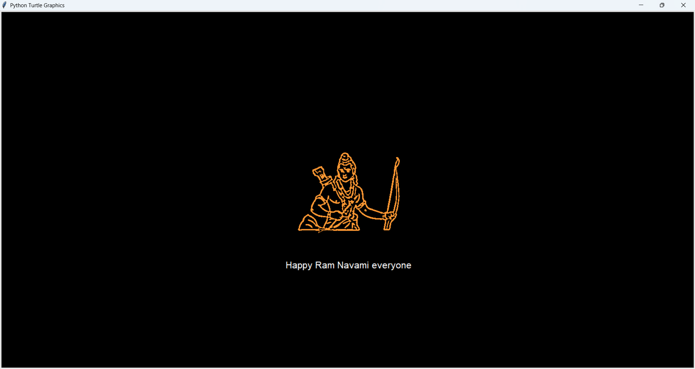

# Ram Navami Festive Animation
---

---
## Overview
This Python script creates a festive animation to celebrate **Ram Navami** using OpenCV and Turtle graphics. It processes an image (`Jai-Shree-Ram-thumb.png`), outlines it with a glowing effect, and enhances the scene with a **gradient sky**, **moving clouds**, **falling flowers**, and **exploding bombs**. The animation concludes with the message **"Happy Ram Navami everyone"** displayed below the image.

## Features
- **Image Edge Detection**: Uses OpenCV to process the image and detect its edges for outlining.
- **Gradient Sky Background**: Draws a smooth blue gradient sky for a realistic backdrop.
- **Moving Clouds**: White clouds drift across the top of the screen, adding a dynamic touch.
- **Falling Flowers**: Pastel-colored flowers fall from the top, enhancing the festive mood.
- **Exploding Bombs**: Gray bombs appear and explode into yellow with orange sparks for excitement.
- **Outline with Glow Effect**: Draws the image outline in saffron with a lighter saffron glow for emphasis.
- **Festive Greeting**: Displays **"Happy Ram Navami everyone"** at the bottom of the animation.

## Requirements
Ensure you have the following dependencies installed:
- **Python 3.x**: Required to run the script.
- **OpenCV** (`opencv-python`): For image processing.
- **NumPy** (`numpy`): For numerical operations.
- **Turtle Graphics**: Included in Python's standard library.
- **Image File**: The script uses `Jai-Shree-Ram-thumb.png` by default, which must be in the same directory.

## Installation
Follow these steps to set up the environment:
1. **Install Python**: Download and install [Python 3.x](https://www.python.org/) if not already installed.
2. **Install Dependencies**: Open a terminal or command prompt and run:
   ```sh
   pip install opencv-python numpy
   ```
3. **Prepare the Image**: Ensure `Jai-Shree-Ram-thumb.png` is in the same directory as the script. If using a different image, update the `image` variable in the script.

## Usage
1. **Save the Script**: Save the provided code as `ram_navami_animation.py` (or any preferred name).
2. **Run the Script**: Open a terminal, navigate to the script's directory, and execute:
   ```sh
   python ram_navami_animation.py
   ```
3. **Watch the Animation**: A Turtle graphics window will open, displaying:
   - A gradient sky background.
   - Moving clouds at the top.
   - Falling flowers with pastel colors.
   - Exploding bombs with sparks.
   - The image outline drawn with a glow effect.
   - The text **"Happy Ram Navami everyone"** at the bottom.

The window will remain open until you close it manually.

## Customization
You can tweak the script to personalize the animation:
- **Change the Image**: Replace `Jai-Shree-Ram-thumb.png` with your own image. Update the `image` variable in the script accordingly.
- **Adjust Colors**:
  - Modify the sky gradient by changing the RGB calculations in `draw_sky()`.
  - Update flower colors in `create_flower()` by editing the RGB tuples.
  - Alter the outline and glow colors in the Turtle setup (e.g., change `(255, 153, 51)` to another RGB value).
- **Control Dynamic Elements**:
  - Increase or decrease the number of clouds, flowers, or bombs by adjusting the limits (e.g., `len(clouds) < 5`).
  - Change the speed of movement by tweaking the timer intervals (e.g., `win.ontimer(move_clouds, 50)`).
- **Edit the Greeting**: Modify the text, font, or position in the `t.write()` call near the end of the script.

## Troubleshooting
- **"Image Not Found" Error**: Verify that `Jai-Shree-Ram-thumb.png` (or your custom image) is in the same directory as the script and that the filename matches the `image` variable.
- **Slow Performance**: If the animation lags:
  - Reduce the number of clouds, flowers, or bombs.
  - Increase the step size in loops (e.g., in `draw_sky()` or the outline drawing loop).
- **Color Issues**: Ensure all RGB values stay between `0` and `255`. The script already clamps values in `draw_sky()`, but check custom colors if you modify them.
- **Window Closes Immediately**: Make sure `turtle.done()` is at the end of the script to keep the window open.

## Notes
- The script uses the image dimensions to adjust the Turtle window and center the outline, so larger images may require more processing time.
- The `CUTOFF_LEN` variable controls the smoothness of the outline drawing—adjust it if the outline appears too jagged or disconnected.

## License
This project is **open-source** and free to use or modify. Feel free to adapt it for other celebrations or purposes!

---

Happy Coding & Jai Shree Ram! 🚀🙏

